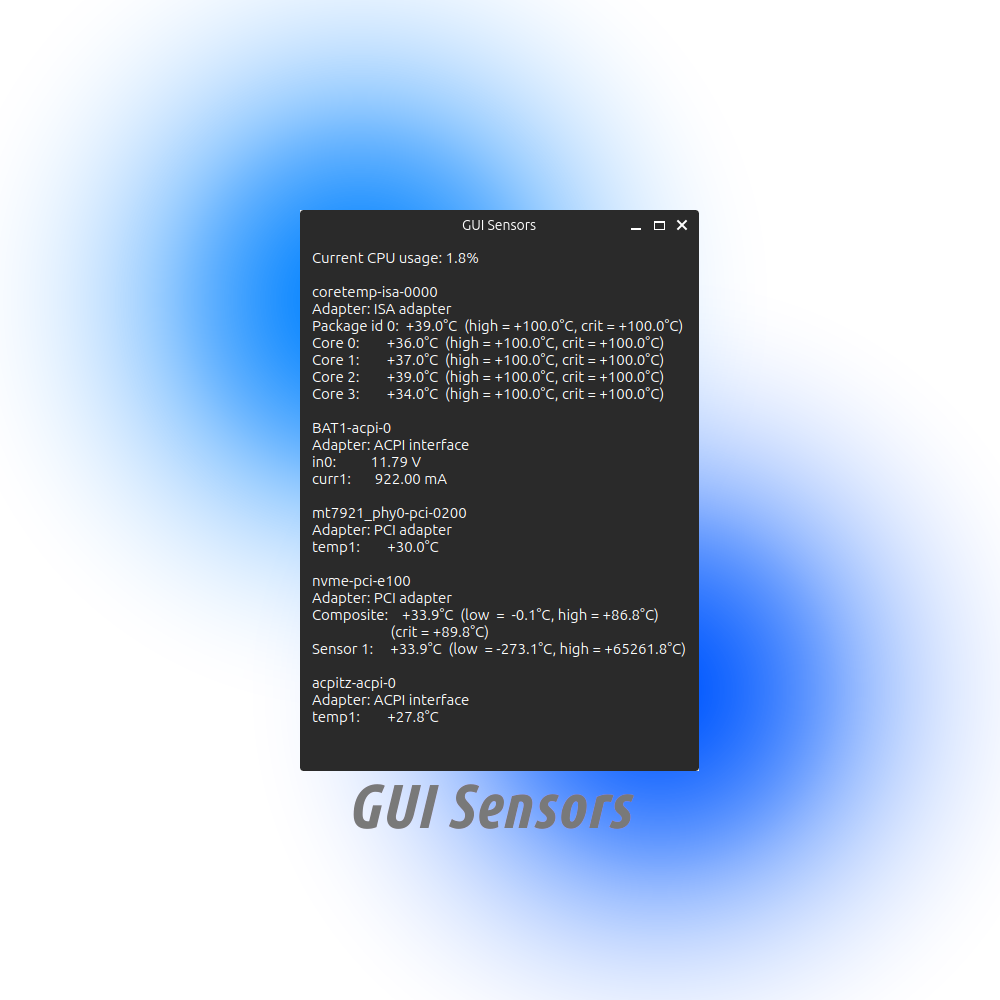

  

  

# GUI Sensors

I think that a lot of Linux users like to check their CPU sensors, but a lot of them just type 'sensors' inside CLI. I was doing the same thing for a very long time, but then I decided that I want to turn this simple command into a full GUI app. Inside this app you have fully the same functionality, but it automatically updates every second and also shows your CPU usage in percents.

**Note: This app is only for Linux and probably MacOS, so even not try to run her on Windows.**

## How to install?

1) Clone repository
2) Install lm-sensors (sudo apt install lm-sensors)
3) Install pyqt6
4) Install psutil

*You can download all these packages by your OS's package manager (pacman, apt, etc) or python's pip.

# To-Do

- [+] **Minimze usage of CPU, RAM, etc:** To show a real results and not affect perfomance in any way we should make this app veeery minimalistic. We have to clean code and remove from him as much as we can.
